# Task Scheduler User Guide

This guide explains how the **45Drives Task Scheduler** module works in Cockpit, what each screen does, how to create and manage tasks, and how each task type can be configured.

It is based on the current `cockpit-scheduler` project structure and behavior in version **1.4.8**.

---

## Table of Contents

1. [What the Module Does](#1-what-the-module-does)
2. [How the Module Works](#2-how-the-module-works)
3. [Dashboard Overview](#3-dashboard-overview)
4. [Understanding Task Status, Scheduling, and Actions](#4-understanding-task-status-scheduling-and-actions)
5. [Creating a New Task](#5-creating-a-new-task)
6. [Managing Schedules](#6-managing-schedules)
7. [Editing Tasks, Notes, Logs, and Removal](#7-editing-tasks-notes-logs-and-removal)
8. [Task Types](#8-task-types)
9. [Cloud Sync Remotes and OAuth](#9-cloud-sync-remotes-and-oauth)
10. [Permissions](#10-permissions)
11. [Tips and Troubleshooting](#11-tips-and-troubleshooting)

---

## 1. What the Module Does

The Task Scheduler module is used to automate recurring server jobs from the Cockpit web interface.

Common examples include:

- Creating recurring ZFS snapshots
- Replicating ZFS datasets locally or to another server
- Copying files with rsync
- Running ZFS pool scrubs
- Starting SMART disk tests
- Syncing data to or from cloud storage with rclone
- Running your own scripts or shell commands

Each task can be:

- Saved without a schedule and run manually when needed
- Assigned one or more schedule intervals
- Enabled or disabled without deleting it
- Viewed in detail from the dashboard
- Logged and viewable from the interface
- Given free-form notes

---

## 2. How the Module Works

At a high level, the module works like this:

1. You create a task from a template such as **ZFS Replication Task** or **Cloud Sync Task**.
2. The task stores its configuration as structured parameters.
3. If you add a schedule, the module stores one or more calendar intervals for that task.
4. The scheduler creates the background schedule entries needed to run it automatically.
5. When the task runs, the matching task handler performs the actual work.
6. Status and logs are read back into the Cockpit interface so you can monitor the task.

### What happens in the background

In normal use, you do not need to manage any of the underlying files yourself.

The module handles the task lifecycle for you:

- it saves the task settings
- it stores the schedule
- it runs the task at the chosen times
- it records logs you can review in **View Logs**
- for Cloud Sync tasks, it uses the saved remote you selected

That means:

- Runs are generally accurate to within about a minute
- Missed runs are not automatically replayed later if the system was off or the schedule was disabled at the scheduled time

### Important behavior to know

- A task can exist without a schedule.
- A task without a schedule can still be run manually with **Run Now**.
- The **Scheduled** toggle only works when the task already has at least one saved interval.
- **Delete Schedule** removes the schedule but keeps the task.
- **Remove** deletes the task itself.

---

## 3. Dashboard Overview

The main dashboard is the central task list for the module.

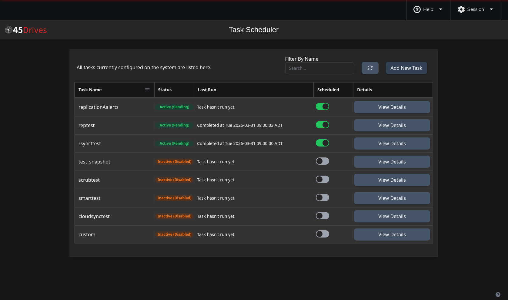

### Top controls

At the top of the dashboard you will see:

- **Filter By Name**: narrows the list to tasks whose names match your search
- **Refresh**: reloads the task list and current status information
- **Add New Task**: opens the task creation dialog

### Task table columns

Each task row includes:

| Column | What it shows |
|--------|----------------|
| **Task Name** | The saved task name |
| **Status** | The current state of the task |
| **Last Run** | The most recent execution result and time |
| **Scheduled** | Whether the saved schedule is enabled |
| **Details** | Opens or closes the expanded task view |

### Sorting

Click **Task Name** to sort the table by name. The column header cycles between ascending and descending order.

### Expanded task row

When you click **View Details**, the row expands and shows:

- A summary of the task configuration
- Current schedules in plain language
- Notes, if any exist
- Quick action buttons

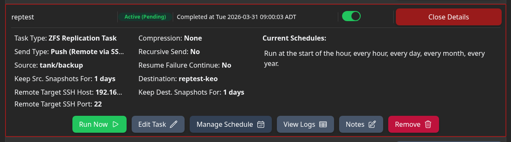

The expanded row actions are:

- **Run Now**
- **Stop Now** when the task is actively running
- **Edit Task**
- **Manage Schedule**
- **View Logs**
- **Notes**
- **Remove**

---

## 4. Understanding Task Status, Scheduling, and Actions

### Common status values

You will normally see one of these:

| Status | Meaning |
|--------|---------|
| **Active (Pending)** | The schedule is enabled and the task is waiting for its next run |
| **Active (Running)** | The task is currently running |
| **Completed** | The most recent run finished successfully |
| **Inactive (Disabled)** | The task has no enabled schedule, or has never run yet |
| **Failed** | The most recent run failed |
| **Completed (manual)** | A manual run completed on a task that does not currently have an enabled schedule |

### Last Run column behavior

Depending on state, the dashboard may show:

- `Task hasn't run yet.`
- `Completed at ...`
- `Failed at ...`
- `Running now...`

### The Scheduled toggle

The toggle in the **Scheduled** column:

- Turns an existing schedule on or off
- Does not create a schedule
- Is disabled if the task has no saved intervals

If the toggle is grayed out, open **Manage Schedule** first and save at least one interval.

### Run Now and Stop Now

- **Run Now** starts the task immediately without waiting for the next timer event
- **Stop Now** appears only when the task is running
- Manual runs do not require a saved schedule

### Remove vs Delete Schedule

- **Remove** deletes the task and its associated scheduler files
- **Delete Schedule** removes only the schedule, leaving the task available for manual use

---

## 5. Creating a New Task

Click **Add New Task** to open the creation dialog.

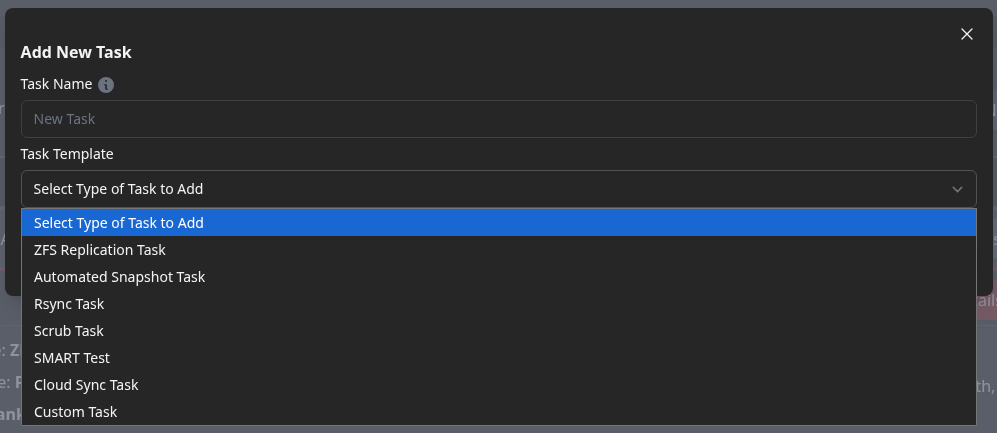

### Step 1: Enter a task name

The **Task Name** field must be unique.

Name rules:

- Letters, numbers, underscores, and spaces are allowed in the UI
- Spaces are converted to underscores when the task is saved
- Duplicate names are not allowed

### Step 2: Choose a task template

Available templates are:

- **ZFS Replication Task**
- **Automated Snapshot Task**
- **Rsync Task**
- **Scrub Task**
- **SMART Test**
- **Cloud Sync Task**
- **Custom Task**

### Step 3: Fill in the task configuration

Once you pick a template, the appropriate parameter form appears.

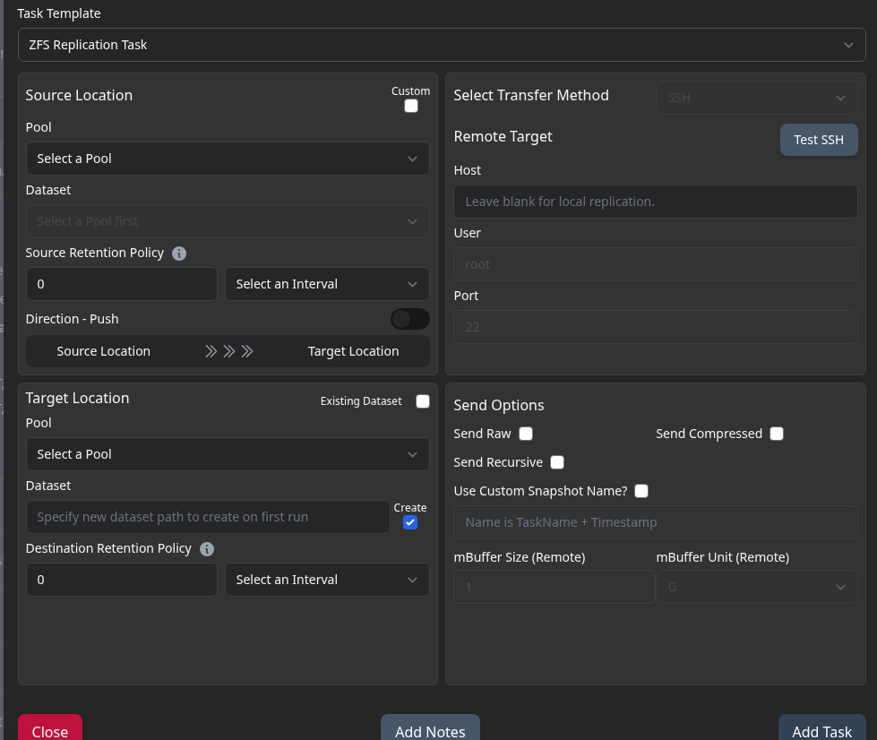

### Step 4: Optional notes

Click **Add Notes** if you want to attach human-readable instructions, context, or reminders to the task.

### Step 5: Save the task

Click **Add Task**.

After saving, the module asks whether you want to schedule the task now.

- If you choose **schedule now**, the **Manage Schedule** dialog opens
- If you choose **schedule later**, the task is saved without a timer and can still be run manually

### Good rule of thumb

Use **schedule later** when you want to:

- test a task manually first
- create a task as a one-off job
- finish the configuration now and decide on timing later

---

## 6. Managing Schedules

The **Manage Schedule** dialog is where you add, edit, preview, enable, disable, or delete schedule intervals.

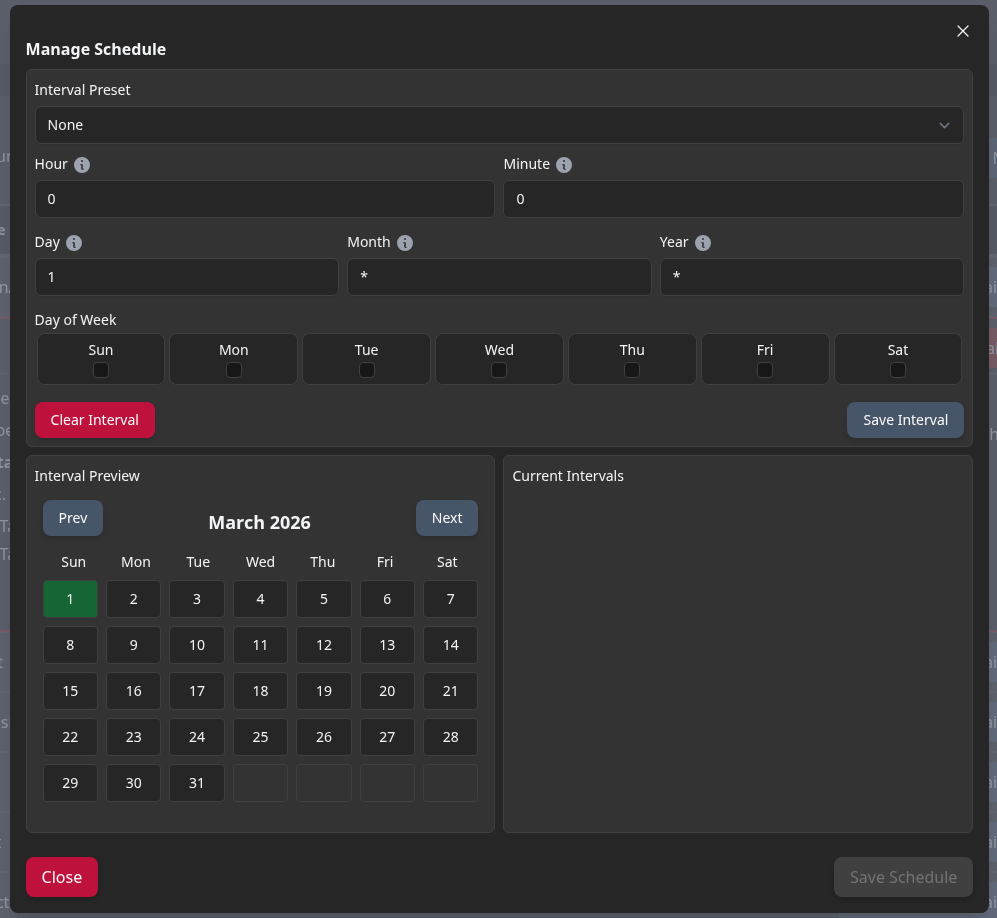

### Schedule presets

The preset list provides quick starting points:

- **None**
- **Minutely**
- **Hourly**
- **Daily**
- **Weekly**
- **Monthly**
- **Yearly**

Preset defaults:

| Preset | Default interval created in the editor |
|--------|----------------------------------------|
| **Minutely** | every minute |
| **Hourly** | at minute 0 of every hour |
| **Daily** | every day at 00:00 |
| **Weekly** | Sunday at 00:00 |
| **Monthly** | 1st day of the month at 00:00 |
| **Yearly** | January 1 at 00:00 |

You can then customize the fields further.

### Interval fields

The scheduler uses calendar-style schedule expressions. The main fields are:

- **Hour**
- **Minute**
- **Day**
- **Month**
- **Year**
- **Day of Week**

### Accepted field patterns

The schedule editor accepts several formats:

| Example | Meaning |
|---------|---------|
| `*` | every value |
| `0` | specific value, such as minute 0 or hour 0 |
| `0/4` | every 4 units starting at 0 |
| `0,15,30,45` | a list of specific values |
| `8..17` | a range |

Important notes:

- If you type cron-style `*/4`, the module automatically converts it to `0/4`
- If you type a hyphen range like `8-17`, it is normalized to `8..17`
- The day-of-week selector is handled separately with checkboxes

### Interval preview

The left side of the dialog includes an **Interval Preview** calendar so you can visually confirm which dates match the current rule.

### Current Intervals

The right side lists saved intervals for that task.

You can:

- click an interval to edit it
- remove an interval
- save multiple intervals for the same task

### Snapshot retention limitation

Tasks that use snapshot retention currently support only **one schedule interval**.

This applies when:

- an **Automated Snapshot Task** has retention enabled
- a **ZFS Replication Task** has source or destination retention enabled

If you need multiple schedules with different retention behavior, create multiple tasks instead of packing everything into one.

### Save Schedule

When you click **Save Schedule**:

- the intervals are attached to the task
- the task timer is updated
- the dashboard reflects the new state

### Delete Schedule

**Delete Schedule**:

- disables the timer
- removes the saved schedule files
- leaves the task itself intact

That means the task can still be run manually after the schedule is deleted.

---

## 7. Editing Tasks, Notes, Logs, and Removal

### Edit Task

**Edit Task** opens the same task-specific form used during creation.

You can adjust:

- task parameters
- endpoints and paths
- retention settings
- transfer options
- remote selections
- task-specific advanced options

If nothing changed, the module closes the editor and reports that no changes were found.

### Notes

The **Notes** dialog lets you save plain text notes for a task.

Typical uses:

- operational reminders
- contact or escalation info
- change history
- naming conventions
- recovery instructions

Saved notes are shown in the expanded task details panel.

### View Logs

The **View Logs** dialog shows task execution output.

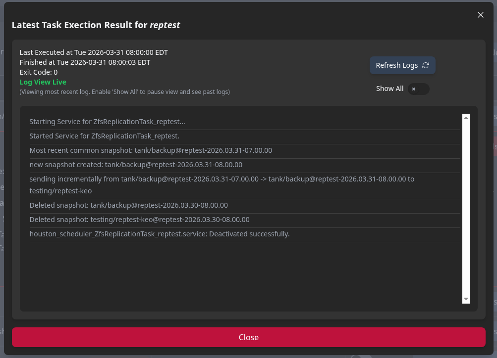

It includes:

- start time
- finish time
- exit code
- live/latest log output
- **Refresh Logs**
- **Show All** to load full history for that task

When **Show All** is enabled:

- live view pauses
- older log history is displayed instead

### Remove

**Remove** permanently deletes the task and its associated scheduler artifacts.

Use this when you no longer need the task at all.

---

## 8. Task Types

This section explains each built-in task type in detail.

---

### ZFS Replication Task

Use this task to replicate ZFS snapshots from one dataset to another.

Typical use cases:

- local replication inside the same server
- replication to another ZFS server over SSH
- push-style replication to a remote destination
- pull-style replication from a remote source

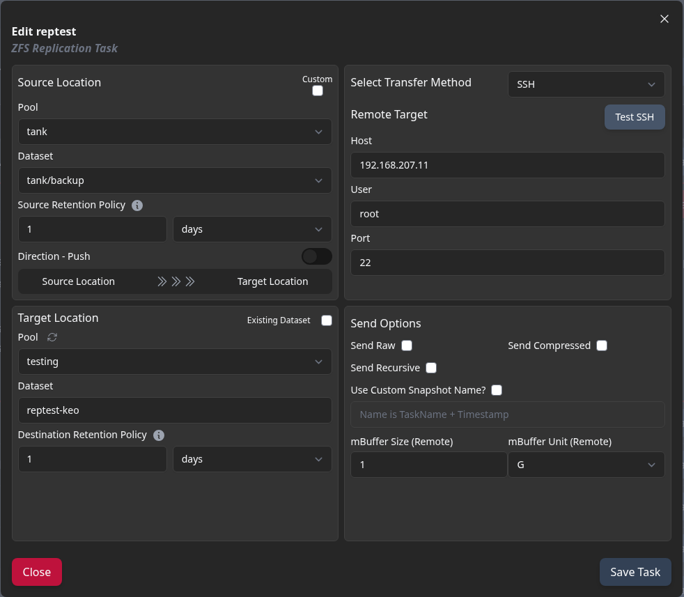

#### Main layout

The form is divided into four main areas:

- **Source Location**
- **Target Location**
- **Remote endpoint / transfer method**
- **Send Options**

#### Direction

The direction switch changes the meaning of the source and target sides:

- **Push**: local source to local or remote destination
- **Pull**: remote source to local destination

Important note:

- **Netcat is not available in Pull mode**
- Pull replication uses **SSH only**

#### Source and destination dataset selection

Each side uses a pool + dataset selector.

Behavior to know:

- For local endpoints, pools and datasets are loaded directly from the system
- For remote endpoints, the module can query the remote server and refresh the pool list
- You can use **Custom** input when needed

#### Existing Dataset

The **Existing Dataset** toggle changes how the destination is treated:

- **On**: choose an already existing destination dataset
- **Off**: provide a new destination path to create on first run

Use **Existing Dataset** when you are continuing or resuming replication into an existing dataset.

Use a new destination path when you want the task to create a fresh target dataset.

#### Transfer Method

The transfer method only matters when a remote endpoint is involved.

Options:

- **SSH**
- **Netcat** for push replication only

Buttons:

- **Test SSH** validates the remote SSH path
- **Test Netcat** checks whether the chosen port is reachable for netcat transfers

Netcat note:

- Port `22` is not allowed for netcat transfers
- Use a dedicated data port instead

#### Send Options

Key options include:

| Option | Meaning |
|--------|---------|
| **Send Raw** | sends raw encrypted/compressed ZFS stream data where appropriate |
| **Send Compressed** | sends a compressed stream |
| **Send Recursive** | includes child datasets in the replication stream |
| **Use Custom Snapshot Name** | adds a custom prefix into the replication snapshot name |
| **mBuffer Size / Unit** | controls mbuffer size used for remote transfers |

Important behavior:

- **Send Raw** and **Send Compressed** are mutually exclusive

#### Retention Policies

ZFS Replication tasks can maintain retention on:

- the **source side**
- the **destination side**

Each retention policy includes:

- **Retention Time**
- **Retention Unit**

Supported units:

- minutes
- hours
- days
- weeks
- months
- years

Retention rules:

- `0` means **keep all snapshots**
- old task-owned snapshots older than the retention window may be pruned
- if the schedule is disabled for longer than the retention window and later re-enabled, older snapshots may be removed on the next run

#### Overwrite and resume behavior

These options matter when the destination already has data:

| Option | What it means |
|--------|----------------|
| **Allow overwrite if no common base or destination is ahead** | allows rollback/forced receive behavior when the destination has diverged |
| **On resume failure, clear token and continue** | if a resume token exists but the destination changed, discard the token and continue with normal replication |

Use these carefully. They are designed for recovery and continuation scenarios, not casual use.

If the task cannot find a safe common snapshot, it may refuse to continue unless overwrite is explicitly allowed.

#### Best practice

Start conservative:

- use a fresh destination dataset if possible
- confirm SSH or netcat connectivity first
- enable overwrite only when you fully understand that the destination may be rolled back

---

### Automated Snapshot Task

Use this task to create scheduled ZFS snapshots on a dataset.

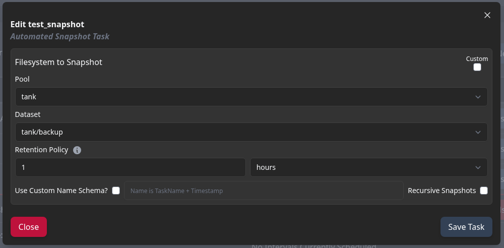

#### Main fields

| Field | Meaning |
|-------|---------|
| **Pool** | the pool containing the dataset |
| **Dataset** | the dataset to snapshot |
| **Recursive Snapshots** | include child datasets |
| **Use Custom Name Schema?** | apply a custom prefix to the generated snapshot name |
| **Retention Policy** | how long snapshots created by this task should be kept |

#### Retention behavior

Automated snapshot retention is very important:

- `0` means **keep all snapshots**
- any value above `0` enables pruning
- pruning applies to snapshots created by the task
- snapshots older than the retention interval can be deleted after a successful run

Example:

- `24 hours` keeps about a day of snapshots created by that task
- `4 weeks` keeps roughly four weeks of that task's snapshots

#### Recursive snapshots

When **Recursive Snapshots** is enabled, the task snapshots the selected dataset and its children in one operation.

#### Custom snapshot names

If enabled, the custom name is used as part of the generated snapshot name, together with the task name and timestamp.

#### Good use cases

- hourly snapshots of important project data
- daily snapshots of home directories
- short-retention safety nets before a larger replication job

---

### Rsync Task

Use this task to copy files locally or over SSH using `rsync`.

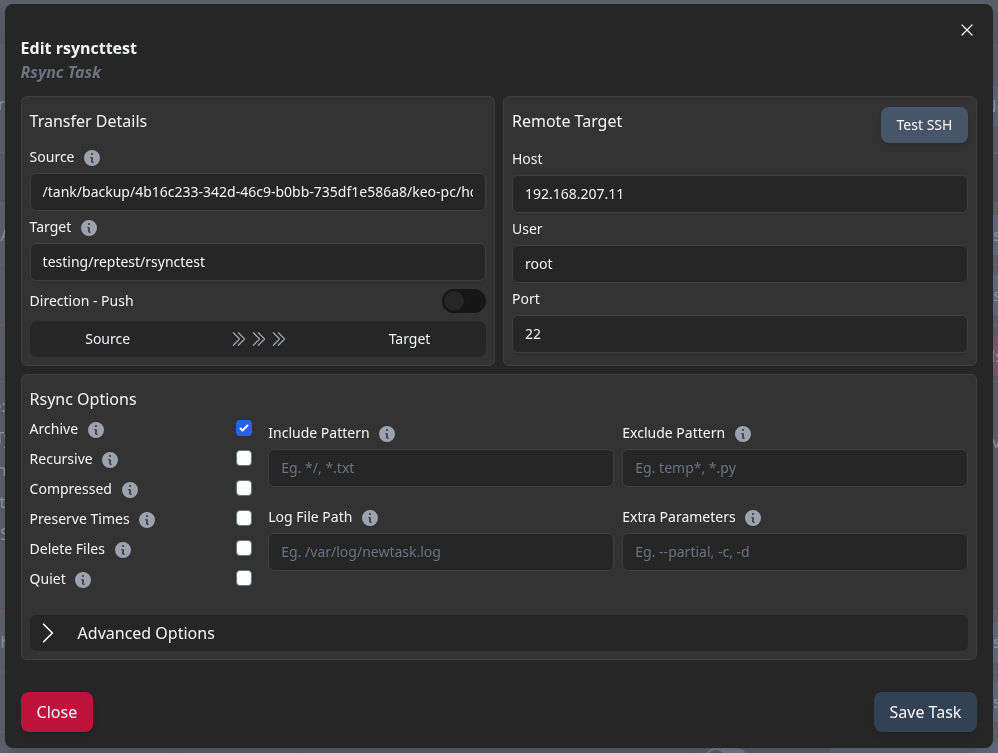

#### What it can do

An Rsync Task can:

- copy locally from one path to another
- push data to a remote host over SSH
- pull data from a remote host over SSH
- mirror directories
- selectively include or exclude files
- preserve metadata

#### Main fields

| Field | Meaning |
|-------|---------|
| **Source** | the source path |
| **Target** | the destination path |
| **Direction** | push or pull |
| **Host / User / Port** | remote SSH details; leave host blank for local transfer |

#### Path behavior and trailing slashes

Trailing slashes matter with rsync:

- `source/` copies the **contents** of the folder
- `source` copies the **folder itself**
- `target/` means copy into that directory
- a target without `/` may create or rename the top-level folder, depending on the source

If you are unsure, test with a small folder first.

#### SSH behavior

If **Host** is blank, the transfer is local.

If **Host** is set:

- rsync uses SSH
- **Test SSH** verifies connectivity before saving

#### Core rsync options

| Option | Meaning |
|--------|---------|
| **Archive** | preserves common metadata and implies recursion |
| **Recursive** | descends into directories |
| **Compressed** | compresses transfer data |
| **Preserve Times** | keeps modification times |
| **Delete Files** | removes destination files that do not exist at the source |
| **Quiet** | reduces non-error output |
| **Include Pattern** | comma-separated include patterns |
| **Exclude Pattern** | comma-separated exclude patterns |
| **Log File Path** | optional rsync log destination |
| **Extra Parameters** | additional comma-separated rsync flags |

#### Advanced options

The advanced area adds:

- **Preserve Hard Links**
- **Preserve Extended Attributes**
- **Preserve Permissions**
- **Limit Bandwidth**
- **Parallel Transfer**
- **Threads**

#### Special rules

- **Delete Files** requires **Archive** or **Recursive**
- **Parallel Transfer** only works when the source is a directory-style path ending in `/`
- higher thread counts can speed up large directory copies, but they also increase CPU, disk, and network load

#### Good use cases

- server-to-server copy jobs
- copying a backup tree to another NAS
- selective file sync with include/exclude patterns

---

### Scrub Task

Use this task to start a ZFS scrub on a pool.

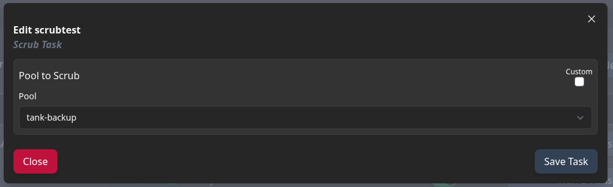

#### Main field

| Field | Meaning |
|-------|---------|
| **Pool** | the ZFS pool to scrub |

#### What happens when it runs

When the task runs:

1. it starts `zpool scrub <pool>`
2. it checks scrub progress through `zpool status`
3. it reports status updates until the scrub completes, stops, or is canceled

This task is useful for routine data-integrity maintenance on a calendar.

---

### SMART Test

Use this task to start SMART self-tests on one or more disks.

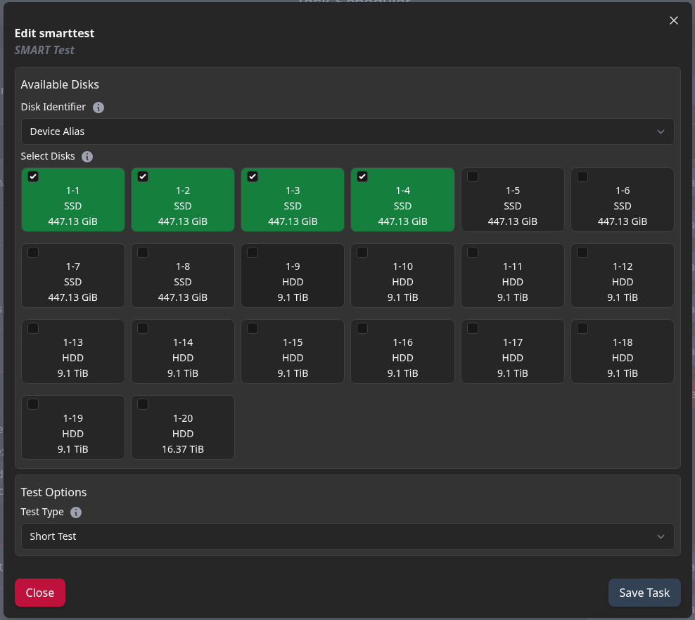

#### Disk selection

The form lets you choose how disks are identified:

| Identifier Mode | Meaning |
|-----------------|---------|
| **Block Device** | device path such as `/dev/sda` |
| **Hardware Path** | physical path under `/dev/disk/by-path/...` |
| **Device Alias** | friendly alias, often aligned with slot naming |

Then you select one or more disks from the grid.

#### Test types

Available test types are:

| Test Type | Meaning |
|-----------|---------|
| **Immediate Offline Test** | quick attribute/error update without a long surface test |
| **Short Test** | short built-in self-test |
| **Long Test** | comprehensive self-test, usually much slower |
| **Conveyance Test** | transport-damage focused test, mainly for ATA drives |

#### Important note about SMART tasks

The scheduler task starts the SMART tests, but long SMART tests continue on the drives themselves after the task command has been issued.

That means:

- the scheduler log confirms that the tests were started
- it does **not** wait hours for a long SMART test to fully finish

Use your normal SMART reporting tools to review final SMART results later.

---

### Cloud Sync Task

Use this task to transfer data between the local system and cloud storage through **rclone**.

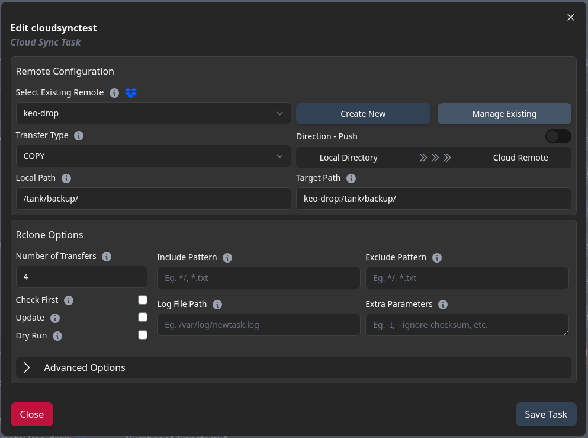

#### Main fields

| Field | Meaning |
|-------|---------|
| **Local Path** | local source or destination path |
| **Target Path** | path inside the selected cloud remote |
| **Transfer Type** | copy, move, or sync |
| **Direction** | push to cloud or pull from cloud |
| **Rclone Remote** | the named cloud account/remote to use |

#### Transfer types

| Transfer Type | Meaning |
|---------------|---------|
| **Copy** | copies data without deleting extra destination files |
| **Move** | copies data, then removes source files after success |
| **Sync** | makes destination match source, which can delete extras |

#### Rclone remote selection

Cloud Sync tasks require a saved **rclone remote**.

From the task form you can:

- choose an existing remote
- click **Create New**
- click **Manage Existing**

The remote itself stores your cloud account connection details. The task only references the remote by name.

#### Basic Cloud Sync options

| Option | Meaning |
|--------|---------|
| **Number of Transfers** | simultaneous file transfers; default is 4 |
| **Check First** | compare before transferring |
| **Update** | skip older destination data and send only newer updates |
| **Dry Run** | simulate changes without modifying data |
| **Include Pattern** | comma-separated include rules |
| **Exclude Pattern** | comma-separated exclude rules |
| **Log File Path** | optional rclone log file |
| **Extra Parameters** | extra comma-separated rclone flags |

#### Advanced Cloud Sync options

The advanced section includes:

| Option | Meaning |
|--------|---------|
| **Checksum** | compare data by checksum when possible |
| **Ignore Existing** | skip files already present on destination |
| **Ignore Size** | ignore size differences during comparison |
| **Inplace** | write directly to destination instead of temp files |
| **No Traverse** | avoid listing the whole destination tree |
| **Limit Bandwidth** | throttle transfer rate |
| **Max Transfer Size** | stop the run after transferring roughly the chosen amount of data |
| **Cutoff Mode** | controls how rclone behaves when the max-transfer limit is reached |
| **Include Files from Path** | read include rules from a file |
| **Exclude Files from Path** | read exclude rules from a file |
| **Multi-thread settings** | chunked transfer tuning for large files |

#### Multi-thread options

When **Use Multiple Threads** is enabled, the UI manages:

- **Chunk Size**
- **Cutoff Size**
- **Number of Streams**
- **Write Buffer Size**

In practice:

- **Chunk Size** controls how large each chunk is
- **Cutoff Size** is the threshold where multi-thread transfer behavior begins to matter
- **Number of Streams** controls parallel streams per file
- **Write Buffer Size** controls transfer buffering

The interface auto-fills sensible defaults when you turn multi-threading on:

- Chunk Size: `64 MiB`
- Cutoff Size: `256 MiB`
- Streams: `4`
- Write Buffer Size: `128 KiB`

#### Important Cloud Sync rules

- **Update** and **Ignore Existing** cannot be enabled together
- If both are chosen, the UI keeps **Update** and turns **Ignore Existing** off
- **Dry Run** simulates behavior but still respects your selection logic
- **No Traverse** can be combined with include/exclude files lists, but the UI warns because that combination can be surprising

#### OAuth refresh behavior

If your remote uses OAuth:

- the task checks token expiry before running
- expired access tokens are refreshed automatically with the saved refresh token

That means long-lived Google Drive, Dropbox, and Google Cloud tasks can keep working without you having to manually re-authenticate every time.

---

### Custom Task

Use this task when the built-in templates do not match your workflow.

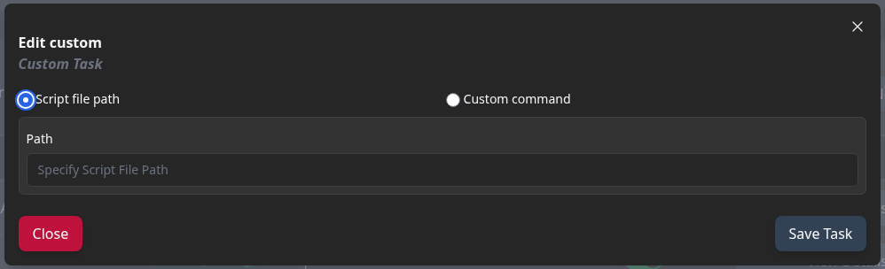

You choose one of two execution styles:

- **Script file path**
- **Custom command**

#### Script file path mode

In this mode, you provide a script path.

The UI expects the path to:

- be a valid file path
- not be the root directory
- avoid invalid filename characters
- end with one of:
  - `.py`
  - `.sh`
  - `.bash`

#### Custom command mode

In this mode, you type a one-line shell command.

The module wraps the command with:

```bash
/bin/bash -c "your command here"
```

This makes Custom Tasks flexible, but it also means you are responsible for:

- command safety
- quoting
- dependencies
- side effects

Use Custom Tasks only when the purpose is clear and the command has been tested manually.

---

## 9. Cloud Sync Remotes and OAuth

Cloud Sync tasks depend on **rclone remotes**.

### What is an rclone remote?

An rclone remote is a named connection profile that stores:

- the cloud provider type
- authentication details
- provider-specific options

Examples:

- `google-backups`
- `dropbox-marketing`
- `aws-archive`
- `storj-offsite`

You create the remote once, then reuse it in any number of Cloud Sync tasks.

### Create Remote screen

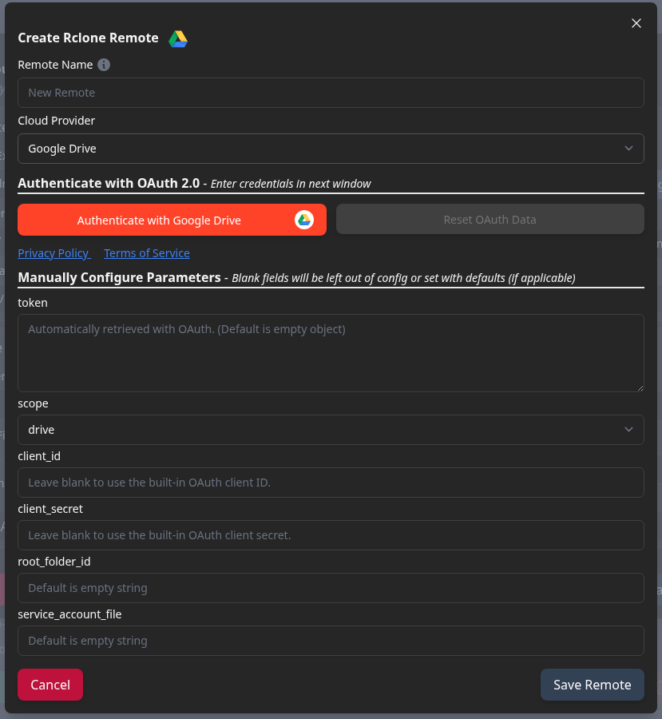

The **Create Rclone Remote** dialog includes:

- **Remote Name**
- **Cloud Provider**
- optional **Authenticate with OAuth 2.0**
- manual provider parameters
- **Save Remote**

Remote name rules:

- letters, numbers, underscores, hyphens, periods, plus signs, `@`, and spaces are allowed
- the name cannot start with `-`
- the name cannot start or end with a space

### Manage Remotes screen

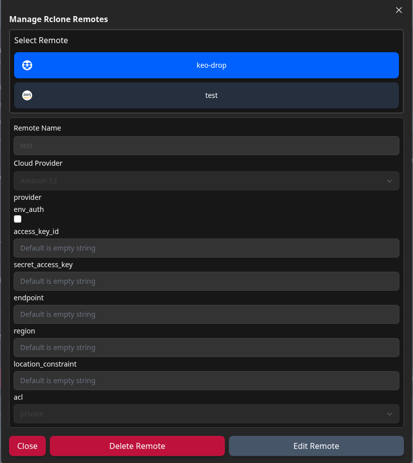

The **Manage Rclone Remotes** dialog lets you:

- browse existing remotes
- inspect the stored provider settings
- enter **Edit Remote** mode
- save changes
- delete a remote

### Supported providers

The module currently supports these providers:

| Provider | Auth Style | Notes |
|----------|------------|-------|
| **Dropbox** | OAuth or manual token/client fields | supported by built-in OAuth flow |
| **Google Drive** | OAuth or manual fields | supports scope, root folder ID, service account file |
| **Google Cloud** | OAuth or manual fields | supports project number, service account file, object/bucket ACLs |
| **Microsoft Azure Blob** | manual credentials | account, service principal file, key, SAS URL, MSI/emulator options |
| **Backblaze B2** | manual credentials | account, key, optional hard delete |
| **Wasabi** | S3-style credentials | provider preset plus access/secret/endpoint/ACL |
| **Amazon S3** | S3-style credentials | provider preset plus access/secret/endpoint/ACL |
| **Ceph** | S3-style credentials | provider preset plus access/secret/endpoint/ACL |
| **IDrive e2** | S3-style credentials | provider preset plus access/secret/endpoint/ACL |
| **Storj** | manual credentials | access grant or new-project details, satellite, passphrase, description |

### OAuth-supported providers

The built-in OAuth popup flow is used for:

- **Dropbox**
- **Google Drive**
- **Google Cloud**

### How OAuth works

When you click **Authenticate with ...**:

1. the module opens a secure sign-in popup for the selected provider
2. you sign in with the provider
3. the popup returns:
   - an access token
   - a refresh token
   - an expiry time
   - a provider/user identifier
4. the token data is stored in the remote configuration

The UI also provides:

- **Reset OAuth Data** to clear the stored token
- **Privacy Policy** and **Terms of Service** links for the OAuth service

### Built-in client IDs and secrets

For OAuth providers, the UI lets you enter:

- `client_id`
- `client_secret`

Depending on how the module is installed, those fields may already be supplied for supported providers. If they are not, you can enter your own values.

This is why the UI placeholders say:

- leave blank to use the built-in OAuth client ID
- leave blank to use the built-in OAuth client secret

### Manual token editing

The token field is stored as JSON.

Advanced users can paste or edit token JSON manually, but the normal workflow is:

- authenticate with the popup
- let the module store and refresh the token automatically

### Where remotes are stored

Behind the scenes, remotes are stored in the system's `rclone` configuration.

Most users do not need to edit that file by hand unless they are troubleshooting or migrating settings.

---

## 10. Permissions

### Access levels

Some deployments limit which task types are visible based on the user's access level.

Administrators can access the full task list.

In limited-access views, users may only see:

- **Rsync Task**
- **Cloud Sync Task**

This helps keep more sensitive system-level tasks restricted to administrative users.

---

## 11. Tips and Troubleshooting

### The schedule toggle is disabled

Cause:

- the task does not have any saved schedule intervals yet

Fix:

- open **Manage Schedule**
- add at least one interval
- click **Save Schedule**

### A task says it has never run

This usually means:

- it was just created
- the schedule is disabled
- the next scheduled time has not happened yet

### ZFS replication cannot find a common snapshot

If the task reports that no common snapshot exists, or that the destination is ahead:

- choose a fresh empty destination dataset
- or explicitly enable overwrite behavior only if rollback is acceptable

### Netcat replication test fails

Check:

- the remote host is reachable
- the chosen netcat port is open
- you are not using port `22`
- netcat is installed on the receiving side

### Remote pool or dataset lists do not populate in ZFS Replication

Check:

- host, user, and port
- SSH connectivity
- that ZFS exists on the remote system
- then use the refresh button beside the remote pool selector

### Cloud Sync says the remote cannot be found

Check:

- the remote was actually saved
- the task references the correct remote name
- the remote still exists in the system's saved remote list

### SMART long tests appear to finish too quickly

This is expected.

The task starts the SMART test, but the drive finishes the long test on its own afterward. Review the final result later using your usual SMART monitoring tools.

### Snapshot retention removed older snapshots

That is expected when:

- retention is set to a non-zero value
- the snapshots belong to that task
- they are older than the configured window

If you want the task to keep everything:

- set retention time to `0`

### Best practices

- Test new tasks manually once before relying on a schedule
- Keep names descriptive and consistent
- Use notes for operational context
- Use separate tasks when retention or schedule needs differ
- Be very careful with destructive options such as **Delete Files**, **Sync**, and ZFS overwrite/rollback behavior

---
